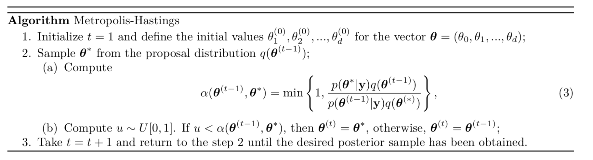
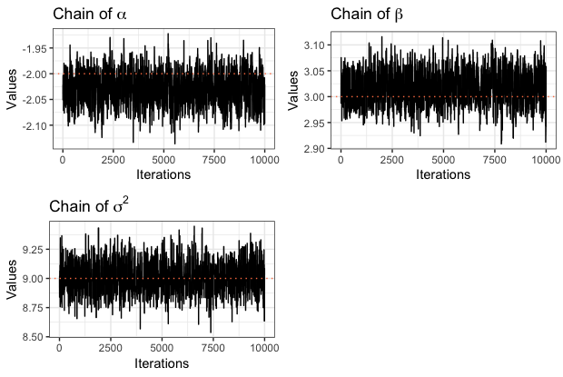
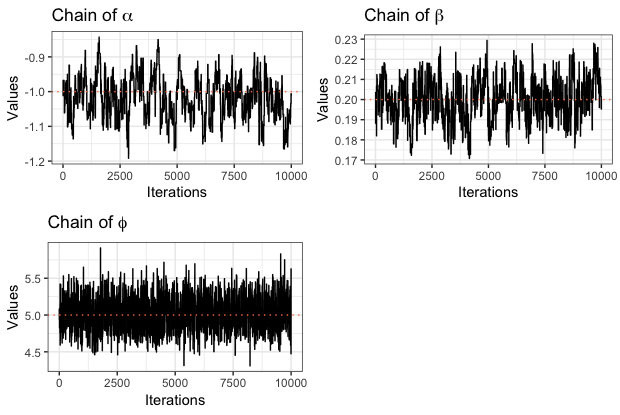

```{r setup, include=FALSE}
options(htmltools.dir.version = FALSE)
```


# Outline

  1. Introduction
  2. Markov Chain Monte Carlo Methods
    - Gibbs sampler
    - Metropolis algorithm
    - Metropolis-Hastings algorithm
  3. Models
    - Linear Regression
    - Logistic Regression
    - Beta Regression
    - Comparison with JAGS
  4. Final Remarks


---
class: inverse, middle, center


# 1.  Introduction

---
# 1.  Introduction

  - Statistical inference can be conducted under two main 
different approaches: classical and Bayesian.
  - From the Bayesian perspective, there is no fundamental distinction 
  between observations and parameters in a model: they are all
  considered random variables.

We can assume prior distributions for the parameters and combine
them with the distribution of the data using the Bayes' theorem 
  
  \begin{equation}
  P(\theta | \mathbf{y}) = \frac{P(\mathbf{y} | \theta) P(\theta)}
  {P(\mathbf{y})}, 
  \end{equation}
  
resulting in what we call the posterior distribution of the parameters. 


---
## The posterior distribution

  - Oftentimes, the posterior distribution of the parameters 
  has no tractable form. 
  - The most common case is when the posterior is obtained up to the 
  Normalization constant. 


```{r, echo=FALSE, fig.align='center', out.height="8%", out.width="8%", fig.height=2}
knitr::include_graphics("img/arrow.png")
```


<center>

**We use Markov Chain Monte Carlo (MCMC) simulation methods to overcome the intractability problem.**


The goal of this presentation is to explain the theory and implementation 
of a few bayesian models using Markov Chain Monte Carlo methods. 

---
## MCMC methods

Consist of, in summary:

  1. Drawing values of $\theta$ from approximate, known distributions;
  2. Correcting the draws in order to get a distribution closer to 
the target one, the $P(\theta | \mathbf{y})$. 


The algorithms perform sequential simulation: the distribution of 
each simulated value depends on the previous one, so 
the draws form a **Markov Chain**. 

- Key for MCMC methods to work: create a Markov process
whose stationary distribution is the target $P(\theta | \mathbf{y})$ and
run the simulation long enough that the current distribution is very
close  to $P(\theta | \mathbf{y})$ .


---
## Illustration - Random Walk Metropolis Hastings


Source: `https://github.com/chi-feng/mcmc-demo`

---
class: inverse, middle, center


# 2. MCMC Methods


---
## Gibbs sampler

Suppose that a parameter vector $\theta$ has been divided into 
*d* components or subvectors, $\theta = (\theta_1,\dots,\theta_d)$.
Each iteration of the Gibbs sampler cycles through the subvectors of
$\theta$, 
**drawing each subset conditional on the value of all the others, making it an iteration with *d* steps**.
An ordering of
the *d* subvectors of $\theta$ is chosen and, in turn, 
$\theta_{j}^{t}$ is sampled from the conditional distribution 
given all the other components of $\theta$:

\begin{align}
p(\theta_j | \theta_{-j}^{t-1}, y) 
\end{align}

where $\theta_{-j}^{t-1}$  represents all the components of $\theta$
except for $\theta_j$. Each subvector $\theta_j$ is updated conditional on the latest values
of the other components of $\theta$, which are the iteration *t* 
values for the components already updated and the iteration 
*t-1* values for the others. 

---
## Gibbs sampler

The idea is to successively sample from each conditional distribution
of $\theta_{j}$ in order to obtain samples from the joint posterior 
distribution:


```{r, echo=FALSE, fig.align='center', out.height="95%", out.width="95%", fig.height=2}
knitr::include_graphics("img/gibbs.png")
```


---
## Metropolis

The basic Metropolis algorithm  is a generalization of the 
Metropolis-Hastings, **being an adaptation of a random walk with an acceptance/rejection rule to converge to the specific target distribution**.

The method makes use of a proposal distribution $J_t(\theta^{*}\mid \theta_{t-1})$
from where it samples from. This proposal distribution always conditioned
on the values of the last iteration and must be symmetric, 
satisfying $J_t(\theta_{a}\mid\theta_{b}) = J_t(\theta_b\mid\theta_a)$ 
for all $\theta_a,\theta_b,$ and $t$. If the ratio of the densities
of the current value and of the previous value is bigger than 
sample from the unit uniform distribution, the 
$\theta^{*}$ is accepted as the new value $\theta^t$.


```{r, echo=FALSE, fig.align='center', out.height="95%", out.width="95%", fig.height=2}

```

---
## Metropolis-Hastings

For the Metropolis-Hastings algorithm, **the proposal distribution $J(\theta^*\mid\theta)$ does not need to be symmetric**.  The speed of the random walk process is improved by the loss of the
symmetry constraint and the convergence to the target distribution
is proved in the same way as for the basic Metropolis algortithm.

Nevetheless, to correct for the assymmetry in the jumping rule, 
the acception value is replaced by a ratio of ratios, as shown in the 
following algorithm: 

```{r, echo=FALSE, fig.align='center', out.height="95%", out.width="95%", fig.height=2}

```


---
class: inverse, middle, center


# 3. Models

---
# Linear Regression 

Consider $\textbf{y} \sim \textbf{N}_{n}(\textbf{X}\boldsymbol\beta, \sigma^{2}\textbf{I})$, assuming that both $\boldsymbol\beta$ and $\sigma^{2}$ are unknown. First, consider a Laplace distribution as prior for each $\beta_{j}| \sigma^{2}$ such as
\begin{align}
     f(\beta_{j} | m_{j}, v_{j}) = (2v_{j})^{-d/2} \exp \Big\{- \sum_{j=1}^{d} \frac{|\beta_{j} - m_{j}|}{v_{j}}\Big\}, \nonumber
\end{align}

where $\beta_{j} \in \mathbb{R}$, $m_{j} \in \mathbb{R}$ and $v_{j} > 0$. In this case, the posterior conditional distribution for $\boldsymbol\beta | \sigma^{2}$ is given by
\begin{align}
    f(\boldsymbol\beta | \textbf{y}, \textbf{X}, \sigma^{2}) & \varpropto f_{\text{y}}(\textbf{y}|\textbf{X}, \boldsymbol\beta) \prod_{i=1}^{d} f(\beta_{j} | m_{j}, v_{j}), \nonumber \\
    & \varpropto \exp \Big\{-\frac{1}{2\sigma^{2}} (\textbf{y} - \textbf{X}\boldsymbol\beta)^\top (\textbf{y} - \textbf{X}\boldsymbol\beta) - \sum_{j=1}^{d} \frac{|\beta_{j} - m_{j}|}{v_{j}} \Big\}. \nonumber
\end{align}


---
# Linear Regression 


As for $\sigma^{2}$, consider as prior distribution an Inverse Gamma, 
denoted by $\sigma^{2}| a, b \sim IG(a, b)$, in the form of
\begin{align}
f(\sigma^{2}| a, b) & = \frac{b^{a}}{\Gamma(a)} (\sigma^{2})^{-(a+1)} \exp \Big\{-\frac{b}{\sigma^{2}}\Big\}, \nonumber
\end{align}
where $a >0$ and $b >0$. Hence, the posterior conditional distribution
for $\sigma^{2}$ is given by

\begin{align}
    f(\sigma^{2} | \textbf{y}, \textbf{X}, \boldsymbol\beta) & \varpropto f_{\text{y}}(\textbf{y}|\textbf{X}, \boldsymbol\beta) f(\sigma^{2}| a, b), \nonumber \\
    & \varpropto (\sigma^{2})^{-(n/2 + a + 1)} \exp \Big\{-\frac{1}{2\sigma^{2}} [(\textbf{y} - \textbf{X}\boldsymbol\beta)^\top (\textbf{y} - \textbf{X}\boldsymbol\beta) + 2b] \Big\}. \nonumber
\end{align}


---
## Simulated data

```{r, echo=FALSE, fig.align='center', out.height="80%", out.width="80%", fig.height=2}

```

$$ Y = \alpha + \beta_1 X_1 $$
---
## R Code

```
for(i in 1:TotIter){
  
  sigma2 <- 1/rgamma(1, a + N/2, rate = (t(y-X%*%MCMCBetasI)%*%(y-X%*%MCMCBetasI) 
  + 2*b)/2) 
  MCMCBetasC <- mvrnorm(1, MCMCBetasI, V)
  
  ratio <- (-0.5*sigma2*(t(y-X%*%MCMCBetasC)%*%(y-X%*%MCMCBetasC)
  - sum(abs(MCMCBetasC - m)/v))) - (-0.5*sigma2*(t(y-X%*%MCMCBetasI)%*%(y-X%*%MCMCBetasI) 
  - sum(abs(MCMCBetasI - m)/v)))
  
  if(runif(1) < min(1, exp(ratio)))
  {MCMCBetasI <- MCMCBetasC
  j <- j+1}
  
  if (i > BurnIn){
    SaveResults[AuxBurnIn,] <- c(AuxBurnIn, MCMCBetasI, sigma2)
    AuxBurnIn <- AuxBurnIn + 1
  }
}
```


---
## Results - R Code


```{r, echo=FALSE, fig.align='center', out.height="80%", out.width="80%", fig.height=2}

```


---
## Python Code

```
for i in tqdm(range(TotIter)):
    
    sigma2 = scy.invgamma.rvs(a = a + N/2, 
    scale = (2*b + (y - (X @ beta_)).T @ (y - (X @ beta_)))/2 , size=1)
    betac = np.random.multivariate_normal(list(itertools.chain(*beta_)), mprop,1).T

    ratio =  ((-0.5*sigma2*(y - (X @ betac)).T @(y - (X @ betac))  - 
    sum(abs(betac - mi) / vi)) -(-0.5*sigma2*(y - (X @ beta_)).T 
    @(y - (X @ beta_))  - sum(abs(beta_ - mi) / vi)))

    if (np.random.uniform(0, 1, 1) < np.exp(ratio)):
        beta_ = betac
        if (i > Burn):
            j = j + 1
    
    if (i > Burn):
        sbeta.append(beta_.tolist())
        ssigm.append(sigma2.tolist())

```

---
## Results - Python Code


.pull-left[


```{r, echo=FALSE, fig.align='center', out.height="90%", out.width="90%", fig.show='hold', fig.pos='h'}
knitr::include_graphics(c("img/python/lm_alpha.png", 
                          "img/python/lm_sigma.png"))
```
]

.pull-right[
```{r, echo=FALSE, fig.align='center', out.height="90%", out.width="90%",  fig.show='hold', fig.pos='h'}
knitr::include_graphics(c("img/python/lm_beta.png"))
```


]

---
# Logistic Regression 

The logistic regression model assumes that a sequence of independent 
and identically distributed random variables $\{Y_{i}\}_{1}^{n}$ has 
a Binomial distribution, denoted by $Y_{i} \sim \mbox{Binomial}(k_{i}, p_{i})$, in the form of

\begin{align}
f(Y_{i} = y_{i}|k_{i}, p_{i}) = {k_{i}\choose Y_{i}} p_{i}^{y_{i}} (1 - p_{i})^{k_{i}-y_{i}} \nonumber,
\end{align}

where $k_{i} \in \mathbb{N}$, $Y_{i} = 1, 2, ..., k_{i}$, $\mbox{log} (\frac{p_{i}}{1-p_{i}}) = \textbf{x}_{i}\boldsymbol\beta$, $p_{i} = \exp\{\textbf{x}_{i}\boldsymbol\beta\}/(1 + \exp\{\textbf{x}_{i}\boldsymbol\beta\})$, $\textbf{x}_{i} = (1, x_{i,1},...,x_{i,1})$ 
is the line vector of covariates associated to the individual $i$ and $\boldsymbol\beta$ is the vector of unknown parameters.

---
# Logistic Regression 

As prior distribution for $\boldsymbol\beta$, we consider a Normal distribution with mean 0 and large variance, denoted by $\boldsymbol\beta \sim N(\textbf{m}, \textbf{V})$. Thus, the joint posterior distribution is given by
\begin{align}
f(\boldsymbol\beta | \textbf{X}, \textbf{y}) & \propto \prod_{i=1}^{n} f(y_{i}|p_{i}) \times f(\boldsymbol\beta), \nonumber \\ 
& \propto \prod_{i=1}^{n} {k_{i}\choose y_{i}} \frac{\exp\{y_{i} \textbf{x}_{i}\boldsymbol\beta\}}{(1 + \exp\{\textbf{x}_{i}\boldsymbol\beta\})^{k_{i}}} \sqrt{(2\pi)^{-d/2}} |\textbf{V}|^{-1/2} \exp\{-\frac{1}{2} (\boldsymbol\beta - \textbf{m})^\top \textbf{V}^{-1} (\boldsymbol\beta - \textbf{m})\}, \nonumber \\
& \propto \prod_{i=1}^{n} \frac{\exp\{y_{i} \textbf{x}_{i}\boldsymbol\beta\}}{(1 + \exp\{\textbf{x}_{i}\boldsymbol\beta\})^{k_{i}}} \exp\{-\frac{1}{2} (\boldsymbol\beta - \textbf{m})^\top \textbf{V}^{-1} (\boldsymbol\beta - \textbf{m})\}, \nonumber \\
& \propto \left( \prod_{i=1}^{n} \frac{1}{(1 + \exp\{\textbf{x}_{i}\boldsymbol\beta\})^{k_{i}}}\right) \exp\{\sum_{i=1}^{n} y_{i} \textbf{x}_{i}\boldsymbol\beta -\frac{1}{2} (\boldsymbol\beta - \textbf{m})^\top \textbf{V}^{-1} (\boldsymbol\beta - \textbf{m})\}. \nonumber
\end{align}


---
## Simulated data

```{r, echo=FALSE, fig.align='center', out.height="80%", out.width="80%", fig.height=2}

```

$$ logit(p) = \alpha + \beta_1 X_1 + \beta_2 X_2 $$
---
## R Code

```

for(i in 1:TotIter){

  MCMCBetasC <- mvrnorm(1, MCMCBetasI, V)
  
  ratio <- ((-k * sum(log(1 + exp(X%*%MCMCBetasC)))  + 
  sum(y * X%*%MCMCBetasC) - (1/2) * t(MCMCBetasC - mu)%*%Sigma_inv%*%(MCMCBetasC 
  - mu)) - ((-k * sum(log(1 + exp(X%*%MCMCBetasI)))) + 
  sum(y * X%*%MCMCBetasI) - (1/2) * t(MCMCBetasI - mu)%*%Sigma_inv%*%(MCMCBetasI - mu)))
  
  if(runif(1) < min(1, exp(ratio)))
  {MCMCBetasI <- MCMCBetasC
  j <- j+1}
  
  if (i > BurnIn){
    SaveResults[AuxBurnIn,] <- c(AuxBurnIn, MCMCBetasI)
    AuxBurnIn <- AuxBurnIn + 1
  }
}

```

---
## Results - R Code


```{r, echo=FALSE, fig.align='center', out.height="80%", out.width="80%", fig.height=2}

```


---
## Python Code

```
for i in tqdm(range(TotIter)):
    
    betac = np.random.multivariate_normal(list(itertools.chain(*beta_)), mprop,1).T

    ratio = ((-k * sum(np.log(1 + np.exp(X @ betac)))  + sum(y * X @ betac) - 
    (1/2) * (betac - mu).T @ Sigma_inv @ (betac - mu)) - 
    ((-k * sum(np.log(1 + np.exp(X @ beta_)))) + sum(y * X @ beta_) - 
    (1/2) * (beta_ - mu).T @ Sigma_inv @ (beta_ - mu)))

    if (np.random.uniform(0, 1, 1) < np.exp(ratio)):
        beta_ = betac
        if (i > Burn):
            j = j + 1
    if (i > Burn):
        sbeta.append(beta_.tolist())

```


---
## Results - Python Code

.pull-left[


```{r, echo=FALSE, fig.align='center', out.height="90%", out.width="90%", fig.show='hold', fig.pos='h'}
knitr::include_graphics(c("img/python/logit_alpha.png", 
                          "img/python/logitb2.png"))
```
]

.pull-right[
```{r, echo=FALSE, fig.align='center', out.height="90%", out.width="90%",  fig.show='hold', fig.pos='h'}
knitr::include_graphics(c("img/python/logitb1.png"))
```


]

---
## Beta Regression 

Let $\{Y_{i}\}_{i=1}^{n}$ be independent and identically distributed 
random variables. We assume that $Y_{i}$ is distributed according to a 
Beta distribution, denoted by $Y_{i} \sim \mbox{Beta}(\mu_{i}, \phi)$, 
where the Beta distribution may be written in the form

\begin{align}
f(Y_{i}|\mu_{i}, \phi) = \frac{\Gamma(\phi)}{\Gamma(\mu_{i}\phi)\Gamma((1-\mu_{i})\phi)} Y_{i}^{\mu_{i}\phi - 1} (1- Y_{i})^{(1-\mu_{i})\phi -1}, \nonumber
\end{align}

where $0 < Y_{i} < 1$, $0 < \mu_{i} < 1$ and $\phi >0$. 
Thus, it is possible to model $g(\mu_{i}) = \textbf{x}_{i}\boldsymbol\beta$,
where $\boldsymbol\beta$ is the vector of unknown parameters and $g(\cdot)$ is
the link function that maps the unit interval into $\mathbb{R}$.

To find the posterior conditional distributions for $\boldsymbol\beta$ and $\phi$,
we set the following priors: $\boldsymbol\beta \sim N(\textbf{m}, \textbf{V})$
and $\phi \sim \mbox{IG}(a, b)$. Firstly, we introduce the posterior conditional distribution for $\boldsymbol\beta$.
\begin{align}
f(\boldsymbol\beta | \textbf{y}, \textbf{X}, \phi) & \varpropto f(\textbf{y}|\mu_{i}, \phi) \times f(\boldsymbol\beta),\nonumber \\
& \varpropto \frac{1}{\prod_{i=1}^{n} \Gamma(\mu_{i}\phi)\Gamma((1-\mu_{i})\phi)}  \prod_{i=1}^{n} Y_{i}^{\mu_{i}\phi - 1} \prod_{i=1}^{n} (1- Y_{i})^{(1-\mu_{i})\phi -1} \times \nonumber\\
& \times \exp \Big\{-\frac{1}{2} (\boldsymbol\beta - \textbf{m})^\top \textbf{V}^{-1} (\boldsymbol\beta - \textbf{m}) \Big\}. \nonumber
\end{align}


---
## Beta Regression 

The posterior conditional distribution for $\phi$, which is proportional
to the multiplication of the likelihood function and its prior distribution (Inverse Gamma) is


\begin{align}
f(\phi | \textbf{y}, \textbf{X}, \phi) & \varpropto f(\textbf{y}|\mu_{i}, \phi) \times f(\phi),\nonumber \\
& \varpropto \left(\frac{\Gamma(\phi)^{n}}{\prod_{i=1}^{n} \Gamma(\mu_{i}\phi)\Gamma((1-\mu_{i})\phi)} \right) \prod_{i=1}^{n} Y_{i}^{\mu_{i}\phi - 1} \prod_{i=1}^{n} (1- Y_{i})^{(1-\mu_{i})\phi -1} \times \nonumber\\
& \times \phi^{-(a+1)} \exp \Big\{-\frac{b}{\phi} \Big\}. \nonumber
\end{align}


---
## Simulated data

```{r, echo=FALSE, fig.align='center', out.height="80%", out.width="80%", fig.height=2}

```

$$ logit(\mu) = \alpha + \beta_1 X_1$$

---
## R Code

```
for(i in 1:TotIter){

  MCMCBetasC <- mvrnorm(1, MCMCBetasI, mprop)
  mu_I <- func_mu(MCMCBetasI) # logit function
  muC  <- func_mu(MCMCBetasC)
  
  
  ratio_beta = ((- sum(log(gamma(muC * phi_I))) - sum(log(gamma((1 -
  muC) * phi_I))) + sum((muC * phi_I - 1) * log(y)) + sum(((1 - muC) 
  * phi_I - 1) *  log(1 - y)) - 0.5 * (t(MCMCBetasC - m) %*% V_1 %*%(MCMCBetasC - m))) - 
  (- sum(log(gamma(mu_I * phi_I))) - sum(log(gamma((1 - mu_I) * phi_I))) + 
  sum((mu_I * phi_I - 1) * log(y)) + sum(((1 - mu_I) * phi_I - 1) * 
  log(1 - y)) - 0.5 * (t(MCMCBetasI - m) %*% V_1 %*%(MCMCBetasI - m))))         
  
                 
  if(runif(1) < min(1, exp(ratio_beta)))
  {MCMCBetasI <- MCMCBetasC
  j_beta <- j_beta +1}
  
  phiC <- rnorm(1, phi_I, Vphi)
```

---
## R Code

```  
  ratio_phi = ((N * log(gamma(phiC)) - sum(log(gamma(mu_I * phiC))) - 
  sum(log(gamma((1 - mu_I) * phiC))) + sum((mu_I* phiC - 1) * log(y)) +
  sum(((1 - mu_I) * phiC - 1) * log(1 - y)) - (a + 1) * phiC - b/phiC) - 
  (N * log(gamma(phi_I)) - sum(log(gamma(mu_I * phi_I))) - 
  sum(log(gamma((1 - mu_I) * phi_I))) + sum((mu_I* phi_I - 1) * 
  log(y)) + sum(((1 - mu_I) * phi_I - 1) * log(1 - y)) - (a + 1) * phi_I - b/phi_I))                     
  
  
  if(runif(1) < min(1, exp(ratio_phi)))
  {phi_I <- phiC
  j_phi <- j_phi +1}
  
  
  if (i > BurnIn){
    SaveResults[AuxBurnIn,] <- c(AuxBurnIn, MCMCBetasI, phi_I)
    AuxBurnIn <- AuxBurnIn + 1
  }
}
```

---
## Results - R Code


```{r, echo=FALSE, fig.align='center', out.height="80%", out.width="80%", fig.height=2}

```

---
## Python Code


```
def func_mu(beta):
    return(np.exp(X @ beta)/(1+np.exp(X @ beta)))

for i in tqdm(range(TotIter)):
    
    betac = np.random.multivariate_normal(list(itertools.chain(*beta_)), mprop, 1).T
    
    mu_ = func_mu(beta_)
    muc = func_mu(betac)
    
    ratio_beta = ((- sum(np.log(Gamma(muc * phi_))) - sum(np.log(
    Gamma((1 - muc) * phi_))) + sum((muc * phi_ - 1) * np.log(y)) + 
    sum(((1 - muc) * phi_ - 1) * np.log(1 - y)) - 0.5 * (betac - m).T
    @ V_1 @(betac - m)) - (- sum(np.log(Gamma(mu_ * phi_))) - sum(np.log(
    Gamma((1 - mu_) * phi_))) + sum((mu_ * phi_ - 1) * np.log(y)) + 
    sum(((1 - mu_) * phi_ - 1) * np.log(1 - y)) - 0.5 * (beta_ - m).T 
    @ V_1 @(beta_ - m)))                       
        
    if (np.random.uniform(0, 1, 1) < np.exp(ratio_beta)):
        beta_ = betac
        if (i > Burn):
            j_beta = j_beta + 1
```


---
## Python Code

```
    phic = np.random.normal(phi_, Vphi, 1)
    
    ratio_phi = ((N * np.log(Gamma(phic)) - sum(np.log(Gamma(mu_ * phic))) -
    sum(np.log(Gamma((1 - mu_) * phic))) + sum((mu_* phic - 1) * np.log(y)) + 
    sum(((1 - mu_) * phic - 1) * np.log(1 - y)) - (a + 1) * phic - b/phic) - 
    (N * np.log(Gamma(phi_)) - sum(np.log(Gamma(mu_ * phi_))) - 
    sum(np.log(Gamma((1 - mu_) * phi_))) + sum((mu_* phi_ - 1) * np.log(y)) + 
    sum(((1 - mu_) * phi_ - 1) * np.log(1 - y)) - (a + 1) * phi_ - b/phi_))                     
   
    if (np.random.uniform(0, 1, 1) < np.exp(ratio_phi)):
        phi_ = phic
        if (i > Burn):
            j_phi = j_phi + 1

    if (i > Burn):
        sbeta.append(beta_.tolist())
        sphi.append(phi_)
```

---
## Results - Python Code

.pull-left[


```{r, echo=FALSE, fig.align='center', out.height="90%", out.width="90%", fig.show='hold', fig.pos='h'}
knitr::include_graphics(c("img/python/beta_alpha.png", 
                          "img/python/beta_phi.png"))
```
]

.pull-right[
```{r, echo=FALSE, fig.align='center', out.height="90%", out.width="90%",  fig.show='hold', fig.pos='h'}
knitr::include_graphics(c("img/python/beta_beta.png"))
```


]

---
# Comparing with JAGS - Beta Regression

```{r bpbr, fig.show='hold', out.width='30%', out.height='60%', fig.align='center', echo = FALSE, fig.cap="Box-plots of the chains for the parameters of the Beta regression."}
knitr::include_graphics(c("img/comp/Beta_Box_plot_Beta.png", "img/comp/Beta_Box_plot_intercept.png", 
                          "img/comp/Beta_Box_plot_phi.png"))
```


```{r dpbr, fig.show='hold', out.width='30%', out.height='60%', fig.align='center', echo = FALSE, fig.cap="Posteriors for the parameters of the Beta regression."}
knitr::include_graphics(c("img/comp/Beta_Density_plot_Beta.png", "img/comp/Beta_Density_plot_intercept.png", 
                          "img/comp/Beta_Density_plot_phi.png"))
```


---
class: inverse, middle, center

# 4. Final Remarks


---
# Final Remarks

The implementation of MCMC by hand is both interesting and challenging!

  - Improved our ability to understand and code our own models from the
beginning to the evaluation of the results. 

  - Some models present complicated conditional distributions that usually 
need some re-arrangements/simplifications.

  - Details can not be forgotten: constants, mispecification of priors, 
  simulated the right data, etc. 
  
**In general, the implementation by hand helped us to have better understanding about mathematical and computational aspects involved in the Bayesian inference process.**  

Possible extensions: pretty much everything in the 
[`JAGS` examples repository](https://github.com/andrewcparnell/jags_examples)! 
---
class: center, middle

## Acknowledgments

This work was supported by a Science Foundation Ireland Career Development Award grant number: 17/CDA/4695

```{r, echo=FALSE, fig.align='center', out.height="40%", out.width="50%", fig.height=2}
knitr::include_graphics("img/SFI_logo.jpg")
```


---

class: center, middle, inverse

# Thanks!

