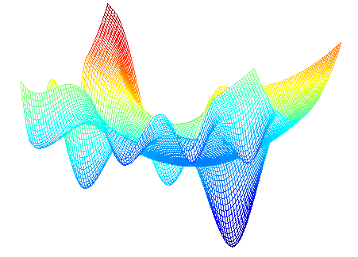
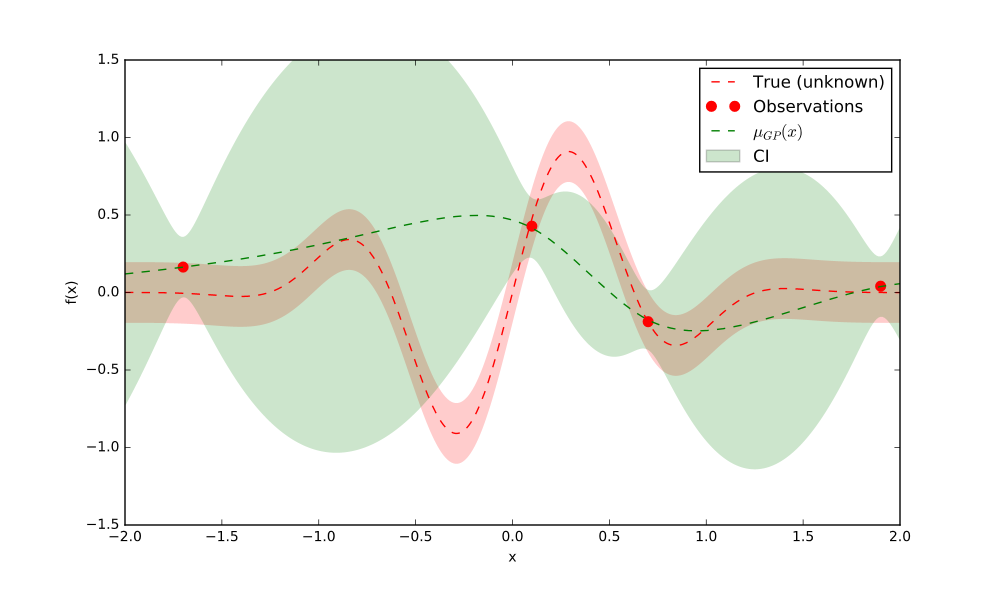
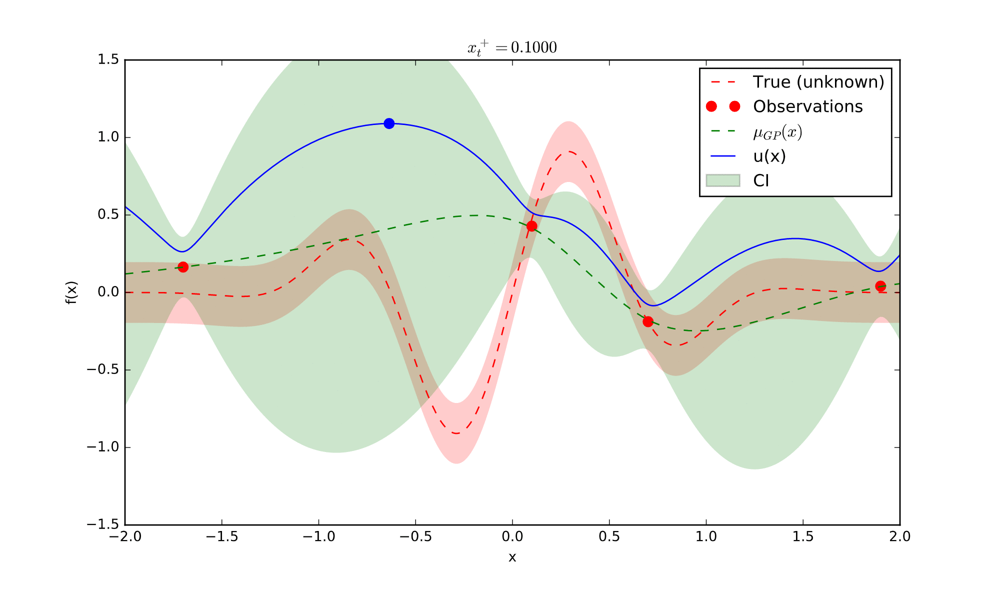

```{r setup, include=FALSE}
options(htmltools.dir.version = FALSE)
knitr::opts_chunk$set(warning = FALSE, message = FALSE, 
                      comment = NA, dpi = 300,
                      fig.align = "center", 
                      out.width = "70%", 
                      cache = FALSE,
                      echo = FALSE)
library(tidyverse)
library(RefManageR)
bibs <- ReadBib("presentation/bibliography.bib", check = FALSE)
```


# Summary

- Parameter Tuning in Machine Learning
- Bayesian Function Optimisation
- Bayesian Optimization of Regularization Paths in Random Forests
  

---

# Big Picture

- Machine learning algorithms often involve the tuning of
parameters 
  - Expert experience, rules of thumb or even brute force
  
- Migh take a lot of time: great appeal for automatic techniques

**We like (and know how) to model things.**
Can we then use a model to select which hyperparameters will be good 
for an algorithm?

```{r, out.width="50%"}

```

...but that will be a tricky optimization problem!

---

# Bayesian Hyperparameter Optimisation

  - **We are interested in finding the minimum of a function $f(x)$ on some bounded $\mathcal{X} \in \mathbb{R}^{D}$, or**
  
  $$x^* = \underset{x \in \mathcal{X}}{\text{arg min}} f(x)$$


Basically, <b> we build a probability model of the objective function and use it to select the most promising parameters. </b> 

$$ P(\text{objective } | \text{ hyperparameters})$$
where the objectives are, e.g., the RMSE , misclassification rate, etc.


For doing Bayesian optimisation, we need:

$$\underbrace{\text{Prior over } f(x)}_{\text{Our assumptions about the  functions being optmized}} + \underbrace{\text{Acquisition function}}_{\text{Determines the next point to evaluate}}$$
 
`r Cite(bibs[key = "bayesopt"])` 

---

## Building a probabilistic model for the objective function 

```{r, out.width="90%"}

```

Source: `https://github.com/glouppe/talk-bayesian-optimisation`


---

## Prior over $f(x)$: Gaussian Processes 

- The classical prior in Bayesian Optimisation
- The GPs are defined by the property that any finite set of $N$ points
induces a Multivariate Gaussian distribution on $\mathbb{R}^{N}$
  - Mean function $m: \mathcal{X} \rightarrow \mathbb{R}$ and 
    covariance function $K: \mathcal{X} \times \mathcal{X} \rightarrow \mathbb{R}$
- Convenient and powerful as a prior: very flexible


## Acquisition Function 

We can now assume $f(\mathbf{x}) \sim GP$ (prior) and 
$y_n \sim \mathcal{N}(f(\mathbf{x}_n), \nu)$, where $\nu$ is the noise
introduced into the function observations. 

- Acquisition Function: $a: \mathcal{X} \rightarrow \mathbb{R}^{+}$, 
determines what point in $\mathcal{X}$ should be the next evaluated 
  - Generally depends on the previous observation and the GP hyperparameters: $a(\mathbf{x}; {\mathbf{x}_n, y_n}, \theta)$
  
Best current value:

$$\mathbf{x}_{best} = \underset{\mathbf{x}_n}{\text{arg min}} f(\mathbf{x}_n)$$


---

## Acquisition Function: choices

Defining the standardised improvement as

$$ \gamma(\mathbf{x}) = \frac{f(\mathbf{x}_{best}) - \mu(\mathbf{x}; {\mathbf{x}_n, y_n}, \theta)}{\sigma(\mathbf{x}; {\mathbf{x}_n, y_n}, \theta)} $$

we can choose to maximize one of the following:
  1. <b> Probability of improvement:</b>
  $$a_{\text{PI}}(\mathbf{x}; {\mathbf{x}_n, y_n}, \theta) = \Phi(\gamma(\mathbf{x}))$$
  
    - Downside: can be <b> greedy </b>, since likely candidates can be close to the current one. 
    
  2. <b> Expected improvement:</b>
  $$a_{\text{EI}}(\mathbf{x}; {\mathbf{x}_n, y_n}, \theta) = \sigma(\mathbf{x}; {\mathbf{x}_n, y_n}, \theta)[\gamma(\mathbf{x})\Phi(\gamma(\mathbf{x}) + \mathcal{N}(\gamma(\mathbf{x}); 0, 1)]$$
  
  3. <b> GP Upper Confidence Bound: </b>
  $$a_{\text{LCB}}(\mathbf{x}; {\mathbf{x}_n, y_n}, \theta) =
  \mu(\mathbf{x}; {\mathbf{x}_n, y_n}, \theta) - \kappa \sigma(\mathbf{x}; {\mathbf{x}_n, y_n}, \theta),$$ 
  
  where $\kappa$ is tunable. 


---

# Algorithm 


.content-box-grey[

1. Choose some **prior** over the space of possible objectives $f$

2. Combine prior and likelihood to get a **posterior** over the objective,
given some observations

3. Use the posterior to find the next value to be evaluated, according
to the chosen **acquisition function**

4. Augment the data (with the new best value)

]

> Iterate between 2 and 4 until you are satisfied

---

## Acquisition Function: in action

```{r, out.width="120%"}

```

Source: adapted from `https://github.com/glouppe/talk-bayesian-optimisation`


---

## All the functions at the same time 
```{r, out.width="120%"}
knitr::include_graphics("img/bayesian_optimization.gif")
```


---
class: inverse, middle, center

Bayesian Optimization of Regularization Paths in Random Forests


---

# Regularization in Random Forests

In `r Cite(bibs[key = "guided"])`, the authors first discuss the idea of regularising 
Random Forests models by penalizing the gain of each 
variable, or 

$$\begin{equation} Gain_{R}(\mathbf{X}_{j}, t) =  \begin{cases} \lambda_{j} Gain(\mathbf{X}_{j}, t), \thinspace  j \notin \mathbb{S} \text{ and} \\ Gain(\mathbf{X}_{j}, t), \thinspace  j \in \mathbb{S}, \end{cases} \end{equation}$$


where $\mathbb{S}$ is the set of indices of the covariates used previously, $\mathbf{X}_{j}, j \in \{1, \dots, p\}$ is the candidate covariate for splitting
and $t$ the respective splitting point.
We proposed a extension to their work, with

$$\begin{equation} \lambda_j = (1 - \gamma) \lambda_0 + \gamma g(\mathbf{x}_j),  \end{equation}$$

where 

  - $\lambda_0 \in [0, 1)$ can be interpreted as the 
baseline regularization, 
  - $g(X_j)$ is a function of the respective $j$-th covariate,
  - $\gamma \in [0, 1)$ is their mixture parameter, under the resctriction that $\lambda_j \in [0, 1)$.

---

# Parameters and parameters

  - The regularized Random Forests work well, but it is not clear
  how to set up their parameters
  
  - Main sources of concern: $\lambda_0$, $\gamma$ and 
  `mtry` values
    - All have shown to be affecting the regularization results
    - $g(X_j)$ should not be tuned but instead defined by hand, 
    since it incorporates expert knowledge about the problem
    
  - Random forests in high-dimensional situations: take a long time to run
    - Should be tuned in a smart way!

## Bayesian Optimisation

  $$P(\text{Objective }_{RRF}| \text{ mtry}, \gamma, \lambda_0, g(\mathbf{x}_j))$$
  


---

## Regularization paths

  - We wish to produce *smooth* plots of the 
  Number of Selected Variables $\times \lambda_j$ 

.pull-left[
```{r, echo = FALSE, fig.width=4, fig.height=3}
x <- seq(0, 1, by = 0.02)
y <- round(seq(1, 200, length.out = length(x))) 

data.frame(x, y) %>% 
  ggplot(aes(x, y)) +
  geom_line(alpha = 0.6) +
  geom_point(color = "#cc0033", size = 0.5) +
  labs(x = expression(lambda[j]), 
       y = "Number of selected variables", 
       title = "Smoothest situation possible!") +
  theme_classic(14)


```

```{r,  fig.width=5.5, fig.height=3.5}
numb_pars <- sample(size = 5000, 1:200, replace = TRUE)


data.frame(pars = numb_pars, 
           names = 1:1000) %>% 
  ggplot(aes(pars)) +
  geom_bar(fill = "#cc0033", size = 0.5) +
  labs(y = "Frequencies", 
       x = "Number of selected variables", 
       title = "Uniform distribution for number\n
of variables frequencies") +
  theme_classic(14)
```


]
.pull-right[
- Main idea: be able to select a point in the plot that will gives
us a good notion of how many variables will be used given some
$\lambda_j$

- The **Objective** function here will be different:
    - We need to optimize the smoothness of the number of
    parameters selected within a group of parameters
]


---

# Number of Parameter Smoothness

**How?**

1. Run the models for different combinations of parameters( $\lambda_0$, $\gamma$ and `mtry`)

2. Check if within each combination of 2 parameters
(for example, $\gamma$ and `mtry`), the distribution of the 
frequencies of the number of selected variables is uniform

    
**Why is that?**

  - We make the assumption that, if the number of variables
  selected is *smooth* within a certain combination of parameters, 
  their frequency distribution should be uniform 
  
> Use the statistic of a KS-test for Uniform distributions as objective!


---


## Given that, our next steps are

  1. Obtain more conclusions from experiments with BayesOpt
  2. Implement the `rrftune` package in `R` and `c++`, which will 
  do the automatic parameter tuning for regularized Random Forests
  3. Combine all with the previous results about regularized Random Forests
  4. Finish paper on the whole subject 
  
**Suggestions?**  


---
class: center, middle

## Acknowledgments

This work was supported by a Science Foundation Ireland Career Development Award grant number: 17/CDA/4695

```{r, echo=FALSE, fig.align='center', out.height="40%", out.width="50%", fig.height=2}
knitr::include_graphics("img/SFI_logo.jpg")
```


---

# References

```{r, results='asis', eval = TRUE}
print(bibs[key = c("guided", "bayesopt", "probml",
                  "Breiman2001", "Friedman1991")], 
      .opts = list(check.entries = FALSE, 
                   style = "html", 
                   bib.style = "authoryear"))
```


---
class: center, middle, inverse

# Thanks!

 

<b>[@brunaw](https://github.com/brunaw)